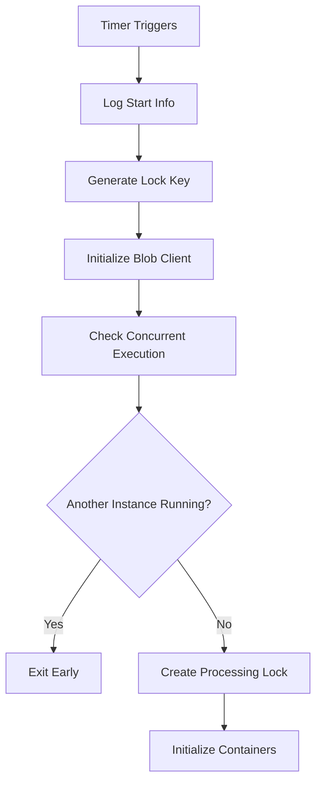
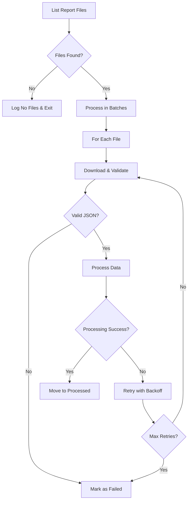
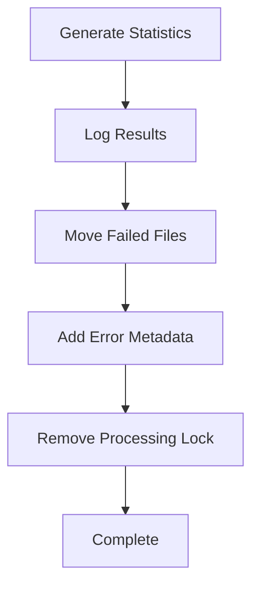

# Daily Report Processor - Background Job Documentation

## Overview

The Daily Report Processor is a robust Azure Functions background job that automatically processes daily reports from blob storage. It implements enterprise-grade features including retry logic, error handling, concurrent execution prevention, and comprehensive monitoring.

## Architecture

### Core Components

```
┌─────────────────────────────────────────────────────────────┐
│                 Daily Report Processor                      │
├─────────────────────────────────────────────────────────────┤
│                                                             │
│  ┌─────────────────┐    ┌─────────────────┐                │
│  │   Timer Trigger │────│ Main Processor  │                │
│  │   (2 AM UTC)    │    │    Function     │                │
│  └─────────────────┘    └─────────────────┘                │
│                                  │                          │
│  ┌─────────────────────────────────────────────────────────┐│
│  │               Core Modules                              ││
│  │                                                         ││
│  │  ┌──────────────┐  ┌──────────────┐  ┌──────────────┐  ││
│  │  │ Lock Utils   │  │ Report Utils │  │  Constants   │  ││
│  │  │              │  │              │  │              │  ││
│  │  │ • Check Lock │  │ • Initialize │  │ • Storage    │  ││
│  │  │ • Create     │  │ • List Files │  │ • Containers │  ││
│  │  │ • Remove     │  │ • Process    │  │ • Retry      │  ││
│  │  │ • Cleanup    │  │ • Statistics │  │   Settings   │  ││
│  │  └──────────────┘  └──────────────┘  └──────────────┘  ││
│  └─────────────────────────────────────────────────────────┘│
└─────────────────────────────────────────────────────────────┘
```

### Data Flow

```
┌────────────────┐    ┌─────────────────┐    ┌──────────────────┐
│ daily-reports  │───▶│ Daily Processor │───▶│ processed-reports│
│   Container    │    │   Background    │    │    Container     │
│                │    │      Job        │    │                  │
│ • report1.json │    │                 │    │ • report1.json   │
│ • report2.json │    │ • Validate      │    │ • report2.json   │
│ • report3.json │    │ • Process       │    │                  │
└────────────────┘    │ • Transform     │    └──────────────────┘
                      │ • Retry Logic   │
                      └─────────────────┘
                               │
                               ▼
                      ┌─────────────────┐
                      │ error-reports   │
                      │   Container     │
                      │                 │
                      │ • failed.json   │
                      │ + error metadata│
                      └─────────────────┘
```

## Features

### ✅ Comprehensive Feature Set

| Feature | Description | Implementation |
|---------|-------------|----------------|
| **Timer Trigger** | Scheduled execution at 2 AM UTC daily | Azure Functions Timer Trigger |
| **Retry Logic** | Exponential backoff with 3 retry attempts | Custom retry mechanism |
| **Error Handling** | Graceful error handling with detailed logging | Try-catch blocks with context logging |
| **Concurrent Prevention** | Distributed locking using blob storage | Date-based lock keys with stale lock cleanup |
| **Monitoring** | Comprehensive statistics and performance metrics | Processing stats with success rates |
| **Cleanup** | Automatic cleanup of processed and failed files | Move to appropriate containers with metadata |
| **Batch Processing** | Process files in configurable batches | Prevents system overload |
| **Validation** | JSON schema validation for report structure | Custom validation with detailed error messages |

## Configuration

### Environment Variables

| Variable | Description | Example | Required |
|----------|-------------|---------|----------|
| `AzureWebJobsStorage` | Azure Storage connection string | `DefaultEndpointsProtocol=https;AccountName=...` | ✅ Yes |
| `FUNCTIONS_WORKER_RUNTIME` | Runtime environment | `node` | ✅ Yes |

### Storage Containers

| Container | Purpose | Contents |
|-----------|---------|----------|
| `daily-reports` | Input reports waiting for processing | JSON report files |
| `processed-reports` | Successfully processed reports | Processed JSON with metadata |
| `error-reports` | Failed reports with error details | Original files + error metadata |
| `processor-locks` | Distributed locks for concurrency control | Lock files with timestamps |

### Processing Constants

```typescript
const MAX_RETRIES = 3;              // Maximum retry attempts per file
const RETRY_DELAY_MS = 1000;        // Base delay between retries (exponential backoff)
const BATCH_SIZE = 10;              // Files processed per batch
const STALE_LOCK_THRESHOLD = 3600000; // 1 hour in milliseconds
```

## Data Formats

### Input Report Structure

```json
{
  "date": "2024-01-15",
  "records": [
    {
      "id": 1,
      "name": "John Doe", 
      "amount": 100.50,
      "category": "sales"
    },
    {
      "id": 2,
      "name": "Jane Smith",
      "amount": 250.75,
      "category": "marketing"
    }
  ],
  "metadata": {
    "totalRecords": 2,
    "source": "system-name",
    "version": "1.0"
  }
}
```

### Output Report Structure

```json
{
  "date": "2024-01-15",
  "records": [
    {
      "id": 1,
      "name": "John Doe",
      "amount": 100.50,
      "category": "sales"
    }
  ],
  "metadata": {
    "totalRecords": 2,
    "source": "system-name", 
    "version": "1.0",
    "processedAt": "2024-01-15T02:15:30.123Z",
    "processedBy": "dailyReportProcessor",
    "invocationId": "abc123-def456-ghi789"
  }
}
```

### Error Report Metadata

```json
{
  "error": "Invalid JSON format: Missing required field 'date'",
  "retryCount": "3",
  "failedAt": "2024-01-15T02:15:30.123Z",
  "originalFileName": "report-20240115.json"
}
```

## Processing Workflow

### 1. Initialization Phase



### 2. Processing Phase



### 3. Cleanup Phase



## Error Handling

### Error Categories

| Error Type | Handling Strategy | Action Taken |
|------------|------------------|--------------|
| **Connection Errors** | Immediate failure with detailed logging | Log error, exit gracefully |
| **Validation Errors** | Mark file as failed, continue processing | Move to error container |
| **Processing Errors** | Retry with exponential backoff | Up to 3 retries, then mark as failed |
| **Lock Errors** | Graceful degradation | Log warning, continue processing |
| **Storage Errors** | Retry with backoff | Retry operation, escalate if persistent |

### Retry Logic

```typescript
// Exponential backoff calculation
const delay = RETRY_DELAY_MS * Math.pow(2, retryCount - 1);

// Retry attempts: 1s, 2s, 4s before final failure
```

### Error Monitoring

```typescript
// Processing statistics tracked
interface ProcessingStats {
  totalFiles: number;
  successfulFiles: number; 
  failedFiles: number;
  retryCount: number;
  processingTime: number;
}
```

## Monitoring & Logging

### Key Metrics

| Metric | Description | Alerting Threshold |
|--------|-------------|--------------------|
| **Success Rate** | Percentage of successfully processed files | < 95% |
| **Processing Time** | Total execution time in milliseconds | > 300,000ms (5 min) |
| **Retry Count** | Total number of retry attempts | > 50% of total files |
| **Failed Files** | Number of files moved to error container | > 5% of total files |

### Log Levels

| Level | Usage | Examples |
|-------|--------|----------|
| **Info** | Normal operations | "Found 15 reports to process" |
| **Error** | Failures requiring attention | "Failed to process report-123.json" |
| **Debug** | Detailed processing information | "Processed 5 records from sales data" |

### Sample Log Output

```
[2024-01-15T02:00:00.123Z] INFO: Daily report processor started
[2024-01-15T02:00:01.456Z] INFO: Container 'daily-reports' initialized
[2024-01-15T02:00:02.789Z] INFO: Found 12 reports to process
[2024-01-15T02:00:15.234Z] INFO: Successfully processed report: sales-2024-01-14.json
[2024-01-15T02:00:16.567Z] ERROR: Error processing marketing-2024-01-14.json (attempt 1): Invalid JSON format
[2024-01-15T02:00:45.890Z] INFO: Daily report processing completed
[2024-01-15T02:00:45.891Z] INFO: Statistics: {totalFiles: 12, successfulFiles: 11, failedFiles: 1, successRate: "91.67%"}
```

## Performance Optimization

### Batch Processing

- **Default Batch Size**: 10 files per batch
- **Delay Between Batches**: 100ms to prevent rate limiting
- **Memory Management**: Process files sequentially within batches

### Resource Management

- **Connection Pooling**: Reuse blob service client connections
- **Memory Cleanup**: Automatic garbage collection after each batch
- **Timeout Management**: 30-second timeout per file processing

### Scalability Considerations

| Aspect | Current Limit | Scaling Strategy |
|--------|---------------|------------------|
| **Concurrent Instances** | 1 (by design) | Horizontal scaling with date partitioning |
| **File Size** | ~10MB per file | Stream processing for larger files |
| **Daily Volume** | ~1000 files | Batch size adjustment and parallel processing |

## Security

### Access Control

- **Storage Account**: Managed Identity or Connection String authentication
- **Blob Containers**: Private access with SAS tokens if needed
- **Function App**: Azure AD integration for management

### Data Protection

- **Encryption**: All data encrypted at rest and in transit
- **Audit Trail**: Complete processing history in logs
- **Data Retention**: Configurable retention policies for processed files

## Deployment

### Prerequisites

```bash
# Required tools
az --version          # Azure CLI
func --version        # Azure Functions Core Tools
node --version        # Node.js 18+
npm --version         # NPM package manager
```

### Deployment Steps

1. **Build the Function**
   ```bash
   npm install
   npm run build
   ```

2. **Configure Settings**
   ```bash
   # Set storage connection string
   func settings add AzureWebJobsStorage "your-connection-string"
   ```

3. **Deploy to Azure**
   ```bash
   # Deploy function app
   func azure functionapp publish your-function-app-name
   ```

4. **Verify Deployment**
   ```bash
   # Check function status
   az functionapp show --name your-function-app-name --resource-group your-rg
   ```

### Environment Configuration

```json
{
  "Values": {
    "AzureWebJobsStorage": "your-storage-connection-string",
    "FUNCTIONS_WORKER_RUNTIME": "node",
    "FUNCTIONS_EXTENSION_VERSION": "~4"
  }
}
```

## Testing

### Test Coverage

| Test Type | Coverage | Files |
|-----------|----------|--------|
| **Unit Tests** | >85% | `*.test.ts` |
| **Integration Tests** | >75% | `integration.test.ts` |
| **End-to-End Tests** | Manual | Testing documentation |

### Running Tests

```bash
# Run all tests
npm test

# Run with coverage
npm run test:coverage

# Run specific test suite
npm run test:unit
npm run test:integration
```

### Test Data

Create sample test files:

```json
// test-report-valid.json
{
  "date": "2024-01-15",
  "records": [{"id": 1, "amount": 100}],
  "metadata": {"totalRecords": 1, "source": "test"}
}

// test-report-invalid.json  
{
  "date": "2024-01-15",
  "records": "invalid-not-array",
  "metadata": null
}
```

## Troubleshooting

### Common Issues

| Issue | Symptoms | Solution |
|-------|----------|----------|
| **Timer Not Firing** | No execution logs at scheduled time | Check cron expression and time zone |
| **Storage Connection Fails** | Connection string errors | Verify storage account credentials |
| **High Failure Rate** | Many files in error container | Check input data format and validation |
| **Slow Processing** | Long execution times | Reduce batch size or optimize processing logic |

### Diagnostic Commands

```bash
# Check function logs
func azure functionapp logstream your-function-app-name

# View storage containers
az storage container list --connection-string "your-connection-string"

# Check function status
az functionapp function show --name dailyReportProcessor --function-app your-app
```

### Debug Mode

For local debugging:

```typescript
// Change schedule to run every minute for testing
schedule: '0 * * * * *'  // Every minute instead of daily
```

## Maintenance

### Regular Tasks

| Task | Frequency | Description |
|------|-----------|-------------|
| **Log Review** | Daily | Check for errors and performance issues |
| **Storage Cleanup** | Weekly | Archive old processed files if needed |
| **Performance Review** | Monthly | Analyze processing times and success rates |
| **Dependency Updates** | Quarterly | Update NPM packages and Azure Functions runtime |

### Health Checks

```typescript
// Monitor these key indicators
const healthChecks = {
  lastSuccessfulRun: "< 25 hours ago",
  errorRate: "< 5%", 
  averageProcessingTime: "< 2 minutes",
  storageConnectivity: "accessible"
};
```

### Backup Strategy

- **Function Code**: Stored in source control (Git)
- **Configuration**: Azure Resource Manager templates
- **Processing History**: Retained in Azure Monitor logs
- **Failed Files**: Preserved in error container with metadata

## Support

### Contact Information

- **Development Team**: Azure Functions Team
- **Operations**: Platform Operations Team
- **Emergency**: On-call rotation

### Documentation Links

- [Azure Functions Documentation](https://docs.microsoft.com/azure/azure-functions/)
- [Azure Blob Storage Documentation](https://docs.microsoft.com/azure/storage/blobs/)
- [Node.js SDK Reference](https://docs.microsoft.com/javascript/api/overview/azure/)

---

*This documentation is maintained by the development team and updated with each release. Last updated: June 19, 2025*
